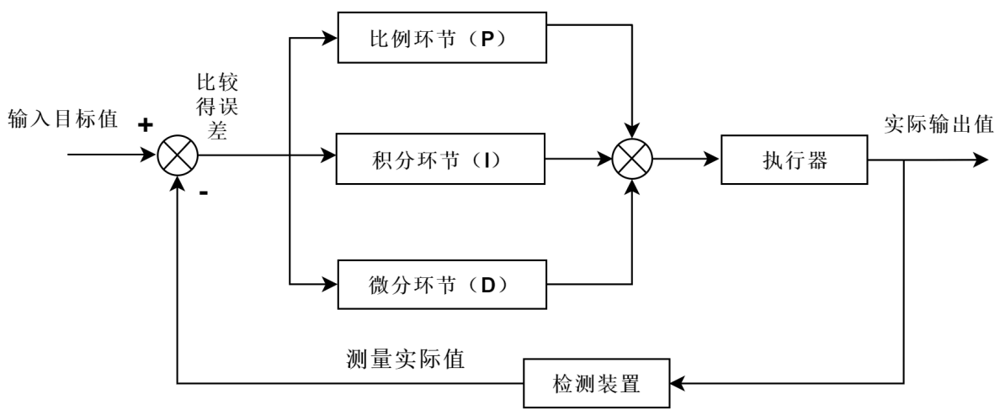
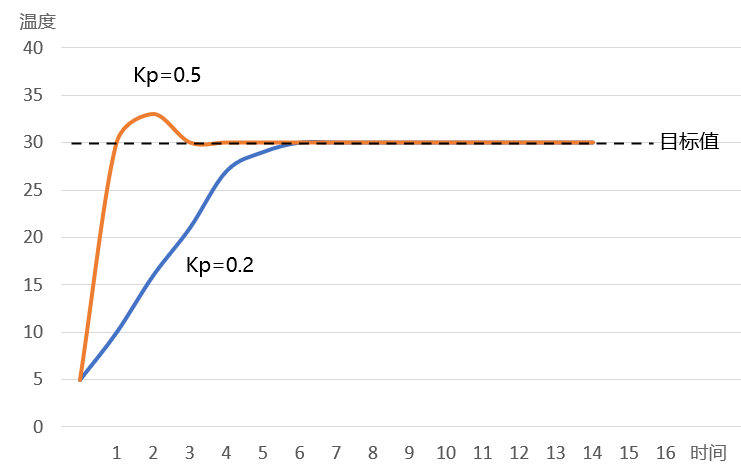
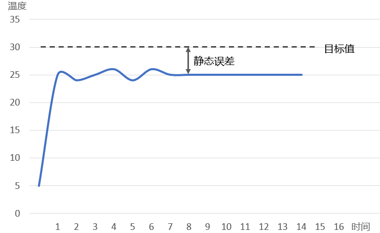
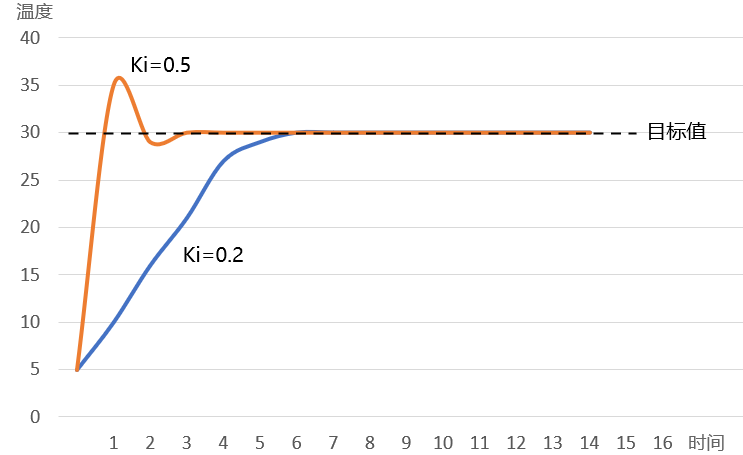

## 什么是 PID

PID算法是闭环控制系统中常用的算法，PID分别是 Proportion（比例）、Integral（积分）、Differential（微分）的首字母缩写。它是一种结合比例、积分和微分三个环节于一体的闭环控制算法。在闭环控制系统中，引入了反馈回路，利用输出（实际值）和输入（目标值）的偏差，对系统进行控制，避免偏离预定目标。闭环控制系统又称反馈控制系统具体的控制流程如下图所示：

连续控制的理想PID控制公式：

$$
u(t) = K_pe(t) + K_i\int_0^te(\tau)d\tau + K_d\frac{d}{d(t)}e(t)
$$

也被写成更常见的标准形PID公式

$$
u(t) = K_p \left( e(t) + \frac{1}{T_t}\int_0^te(\tau)d\tau + T_d\frac{d}{d(t)}e(t) \right)
$$

- $T_{i}$为积分时间
- $T_{d}$为微分时间

在标准形下，这些参数具有明确的物理意义，输出是根据现在误差、过去误差及未来误差而决定，微分项用来补偿$T_{d}$时间后的误差，积分项则根据所有过去误差的总和进行调整，希望在$T_{i}$时间后可以完全消除误差，而输出的值会再乘以单一的增益$K_p$。

### 比例环节(Proportion)

比例环节可以成比例地反应控制系统的偏差信号，即输出与输入偏差成正比，可以用来减小系统的偏差。此环节的公式如下：

$$
u = K_p \cdot e
$$

> 假设我们现在需要调节棚内温度为 30℃，而实际温度为 10℃，此时的偏差 e=20，由比例环节的公式可知，当 e 确定时，$K_p$ 越大则输出 u 越大，也就是温控系统的调节力度越大，这样就可以更快地达到目标温度,在比例环节中，比例系数 $K_p$ 和偏差 e 越大则系统消除偏差的时间越短

当$K_p$的值越大时，其对应的橙色曲线达到目标值的时间就越短，与此同时，橙色曲线出现了一定幅度的超调和振荡，这会使得系统的稳定性下降，因此，我们在设置比例系数的时候，并不是越大越好，而是要兼顾消除偏差的时间以及整个系统的稳定性

### 积分环节(Integral)

在实际的应用中，如果仅有比例环节的控制，可能会给系统带来一个问题：静态误差。静态误差是指系统控制过程趋于稳定时，目标值与实测值之间的偏差

> 假设我们现在需要调节棚内温度为 30℃，而实际温度为 25℃，此时偏差 e=5， $K_p$ 为固定值1，如果此时的输出可以让大棚在半个小时之内升温 5℃，而外部的温差可以让大棚在半个小时之内降温 5℃，也就是说，输出 u 的作用刚好被外部影响抵消了，这就使得偏差会一直存在

> 积分环节可以对偏差 e 进行积分，只要存在偏差，积分环节就会不断起作用，主要用于消除静态误差，提高系统的无差度。引入积分环节后，比例+积分环节的公式如下：

$$
u(t) = K_pe(t) + K_i\int_0^te(\tau)d\tau
$$

> 只要系统还存在偏差，积分环节就会不断地累计偏差。当系统偏差为 0的时候，说明已经达到目标值，此时的累计偏差不再变化，但是积分环节依旧在发挥作用（此时往往作用最大），这就很容易产生超调的现象了。因此，我们需要引入微分环节，提前减弱输出，抑制超调的发生。

> 积分控制会加速系统趋近设定值的过程，并且消除纯比例控制器会出现的稳态误差。积分增益越大，趋近设定值的速度越快，不过因为积分控制会累计过去所有的误差，可能会使回授值出现过冲的情形。

### 微分环节(Differential)

微分环节的作用是反应系统偏差的一个变化趋势，也可以说是变化率，可以在误差来临之前提前引入一个有效的修正信号，有利于提高输出响应的快速性, 减小被控量的超调和增加系统的稳定性。引入微分环节后，比例+积分+微分环节的公式如下：

$$
u(t) = K_pe(t) + K_i\int_0^te(\tau)d\tau + K_d\frac{d}{d(t)}e(t)
$$

这就是PID的最终公式，在实际的应用中，并不是每一个系统都需要 PID 的三个环节参与控制的，有的系统只需要比例环节或积分环节就可以控制得很好。

微分环节有助于系统减小超调，克服振荡，加快系统的响应速度，减小调节时间，从而改善了系统的动态性能，但微分时间常数过大，会使系统出现不稳定。微分控制作用一个很大的缺陷是容易引入高频噪声，所有在干扰信号比较严重的流量控制系统中不宜引入微分控制作用。

> 微分控制可以提升整定时间及系统稳定性。不过因为纯微分器不是因果系统，因此在PID系统实现时，一般会为微分控制加上一个低通滤波器以限制高频增益及噪声。实际上较少用到微分控制，估计PID控制器中只有约20%有用到微分控制

---

## 增量式 PID 公式

假设 $\Delta t$ 为采样周期，k 为采样序号 离散化可以得到

$$
\int_0^{t}e(\tau)d\tau = \sum_{i=1}^ke_i\Delta t
$$

$$
\frac{d}{d(t)}e(t)=\frac{e_k-e_{k-1}}{\Delta t}
$$

得到

$$
\begin{aligned}
u_k&=K_pe_k +K_i\sum_{i=1}^ke_i\Delta t +  K_d\frac{(e_k-e_{k-1})}{\Delta t} \\
&= K_pe_k + K_i\sum_{i=1}^ke_i+K_d(e_k-e_{k-1})
\end {aligned}
$$

计算前一项

$$
u_{k-1} = K_pe_{k-1}+ K_i\sum_{i=0}^{k-1}e_{i}+K_d(e_{k-1}-e_{k-2})
$$

二者作差

$$
\begin{aligned}
u_{k} - u_{k-1} &= K_p ( e_k-e_{k-1} )\\
&+ K_i (e_k )\\
&+K_d (e_k - 2e_{k-1} + e_{k+2})
\end{aligned}
$$

### 增量式PID

#### 优点：

- 运算量小：增量式PID只计算当前时刻的增量（控制量的变化），而不是控制量的绝对值，减少了计算量，适合系统响应速度较快的场合。
  抗干扰能力强：由于只根据误差的增量调整输出，对过去的累积误差影响较小，能有效应对控制器中途的瞬时干扰。
- 平滑控制：增量式PID只调整当前时刻的输出，不会突然跳变，适合控制连续变化的系统。
- 安全性高：即使发生计算错误或数据丢失，输出不会发生大幅度变化，系统较为安全。

#### 缺点：

- 调试难度较大：增量式PID的输出是增量，控制效果依赖于精确的参数设置，如果参数不合适，容易导致系统振荡。
- 系统响应滞后：由于控制器根据误差的增量来调整输出，可能会导致系统对较大的误差响应滞后。

### 位置式PID

#### 优点：

- 控制精度高：位置式PID直接计算控制量的绝对值，能够精确地调整系统到目标值，适用于需要高精度控制的场合。
- 调试较为简单：由于控制量是根据当前误差的绝对值计算的，系统对误差的响应更直接，相对容易调节参数以达到理想效果。
- 适应大误差环境：位置式PID能够很好地处理大误差情况，并迅速将系统带入平衡状态。

#### 缺点：

- 大幅跳变风险：位置式PID直接输出控制量，如果误差突变或发生故障，可能会导致控制器输出发生较大的跳变，造成系统不稳定。
- 抗干扰能力较弱：对中途的干扰较为敏感，特别是在系统误差较小时，容易因为外部干扰导致控制量大幅变化。
- 运算量较大：每次计算都要得出绝对的控制量，运算复杂度高于增量式PID。

### PID 总结

$K_p$ 偏差一产生，控制器立即做出响应，产生控制作用，使控制量向减少偏差的方向变化;
$K_i$ 消除系统的静态误差；但同时会降低系统的响应速度，增加超调量；积分时间越长，积分的积累作用越弱，消除静态误差的时间会变长；但系统过渡时不会产生振荡，可以减少超调量，提高系统的稳定性;
$K_d$ 加快调节过程，阻止偏差的变化；有助于减少超调量，克服振荡，使系统趋于稳定。

增量式PID更适合于对抗干扰能力要求较高、系统稳定性优先、计算资源有限的场合。
位置式PID更适合高精度控制、误差较大、响应速度要求较快的场景，但需要更多的计算资源和合理的参数调试。

---

## PID在推荐系统中的应用

### 流量分发场景

从行业角度，主要分为电商场景与内容场景。

在电商场景上，流量分发的主要目标是

- 平衡平台的短期收益与长期收益
- 低成本撬动商家优质货品资源，提供行业控比的目标，从而提高平台对于供应链的掌控力度
- 用流量换取商家的广告费、价格折扣、优质货品独家渠道等，实现平台、商家、用户三方共赢
- 满足特定商家的营销诉求，促进平台商家健康活跃发展，提升平台用户和商家价值及商业化
  > 换句话说怎么插广告让用户不烦。这里场景和超曝呼唤相似

在内容场景上，流量分发的主要目标是

- 促进发布，增大内容池，给新内容流量倾斜，新内容获得的曝光越多，作者创作积极性越高
- 挖掘优质内容，让每篇新内容都能获得足够曝光
  > 其实和上面的场景类似，只是目的不同

#### 流量调控手段

- 在推荐链路中，干涉召回、重排等环节
- 在指定时间段内，提升指定商品集合的某种行为类型次数绝对值，如: 曝光pv绝对值、点击量绝对值
  支持两种调控类型
  - **保量**：规定时间段内，单位时间（如，每天）的流量至少为设定值，实际流量可以超过设定值
  - **逼近**：规定时间段内，单位时间（如，每天）的流量逼近设定值，不会大幅超过设定值

#### 流量调控系统的参考评价指标

1. 作者侧指标（反映作者的发布积极性）

- 发布渗透率=当日发布人数/日活人数
- 人均发布量=当日发布内容数/日活人数

2. 用户侧指标

- 调控内容指标：调控内容的点击率、交互率等
- 大盘指标：消费时长、日活、月活

3. 内容侧指标

- 高热内容占比（衡量系统挖掘优质内容的能力）
- 调控目标达成度

### PID的应用

任何流量调控算法或策略或多或少都会对大盘的短期业务指标造成一定的负面影响（除非推荐算法本身还有很大的提升空间）。 这里我们假设原有的推荐算法是一个完美的算法，它推出的物品集合以及物品之间的排序都是最优的，任何变动都会造成短期业务指标的下跌。

PID算法只能保证调控目标的达成，但本身并没有办法把对大盘业务指标的负面影响控制在一定范围内。

因此，在PID算法之上还需要加入各种流量平滑的策略和机制，来尽可能减少调控带来的负面影响。 我们采用的流量平滑策略包括但不限于：

- 个性化调控。根据用户对调控物品的偏好程度调控，尽可能把调控流量分配给确实需要的用户。
- 动态调控目标。渐进式达成全天的目标，在时间上平滑。根据预估流量，非线性地设置每个时刻的调控目标。
- 打散约束。每个请求仅能承载有限数量的调控上提物品，并且曝光位置不能过于集中。

### 调控公式

- https://zhuanlan.zhihu.com/p/521628743

为了使得PID算法的调参经验能够更好地在不同场景间迁移，我们没有采用常规的对排序分进行加权/降权的方式，而是采用了直接调整排序位置的策略。

> 1. 确保了模型分值依然保持稳定
> 2. 调参方便
> 3. 可以在不同种类任务中迁移

假设展示位置调整量为$\Delta rank$,那么

$$
new\_rank = model\_rank - \Delta rank
$$

然后按照 new_rank 进行排序

其中$\Delta rank$的计算公式如下

$$
\Delta rank(t,i)=
\begin{cases}
 & \alpha_t \cdot(1+\gamma tanh (\beta w_t))\cdot e^{score_i/max\_score}  &  {\alpha_t>0}\\
 & \alpha_t \cdot(1/(1+e^{10-r_i \eta \cdot (1-tanh (w_t))}))  &    {\alpha_t<0}
\end{cases}
$$

这里 t 对应一个调控目标，i 对应一个 item，$score_i$ 是 item i 的模型得分，max_score 是得分最高的 item 的模型分
$r_i$是按照模型分降序排列得到的 rank 位置；
$\alpha_t$的 PID 算法输出的调控信号；
$w_t$是调控目标 t 的权重，反应当前用户对当前调控目标商品集合的总体偏好程度，计算公式为

$$
w_t = \frac{\sum_{i\in t} score_i \cdot e^{-0.01r}}
{\sum_{i} score_i \cdot e^{-0.01r}}
$$

> 这里的含义是同一批item中，不是所所有的item都需要被调控，调控的目标t也不一致，因此考虑每一个目标的单独影响

最终的调控位置偏移值的计算即为所有调控目标求和：

$$
\Delta final\_rank(i) = \sum_t \Delta rank(t,i)
$$

### 阶段性细粒度拆解调控目标

阶段性拆解目标指调控任务在执行过程中，每个时刻
需要去逼近的目标，是一个关于时间以及daily总目标
的函数。
PID调控算法中最重要的计算差分的环节就需要计算当前时间的累计流量与目标流量的差值。然而，我们只会设置一段时间（如，每天）的总目标，总目标是这段时间累计需要达成的目标，在调控过程中的任意时刻直接去逼近总目标是有问题的，会使得算法急于达成目标，影响大盘效果。比如，试图在一天刚开始不久时就达成一整天的目标是不合理的。

> 比如我们在动态场景设置的目标为1天曝光30次，在极端情况下，会出现动态刚发布，立即就被曝光30次了，这显然是不合理的。

每个时刻算法只需要去逼近总目标的一部分就行了，那么该如何为当前时刻设置一个合理的目标值呢？

1. 线性分解：总目标在时间上均匀切分。

- 优点：实现简单；
- 缺点：与流量的自然分布不匹配；存在部分时间段调控比较激进，部分时间段调控比较慵懒的问题；
  $$
  f(t,T) = \frac{t-t_{min}}{t_{max}- t_{min}} \cdot T
  $$

2. 非线性分解：总目标在时间上不均匀切分。尽量去匹配流量随时间的自然分布
   $$
   f(t,T) = \frac{\hat{C_t}}{\sum_i\hat{C_i}} \cdot T
   $$
   其中，$\hat{C}$是预估的当天从零点到 t 时刻的累计流量。

### 流量预估模型

调控系统十分依赖输入的流量调控目标，如果输入给调控系统的流量调控目标不合理，会极大的提升调控的难度。因此，在进行流量调控前，需要得到合理的流量调控目标。

目的：

- 辅助判断调控目标是否合理，过高的目标可能会导致目标无法达成；同时也会造成大盘指标下降，以及对内容产生拔苗助长的效应，
- 细粒度拆解调控目标，得到每个时间段的子目标，流量调控目标需要在时间上做到平滑，步调太大会影响大盘指标和用户体验
  - 大盘流量在时间上并不是均匀分布；e.g. 深夜流量少
  - 内容流量在时间上也不具有一致性；e.g. 成人用品的流量基本都集中在夜里

步骤：

1. 以(半)小时为单位，构建模型预估每个item (or item pool)在每个时间段的自然流量 $\hat{C_t}$
2. 以(半)小时为单位，计算每个时间段的预估自然流量占比 $ratio_h=\frac{\hat{C}_h}{\sum_t \hat{C}_t}$
3. 计算每(半)个小时流量调控目标： $target_h=ratio_h \cdot SetPoint $
4. 在每个时间段内部采用线性分解的方法得到每分钟的拆解目标值这里的流量不一定是指曝光流量，也可能指IPV，或者GMV等。
   > 这里的流量不一定是指曝光流量，也可能指IPV，或者GMV等。
