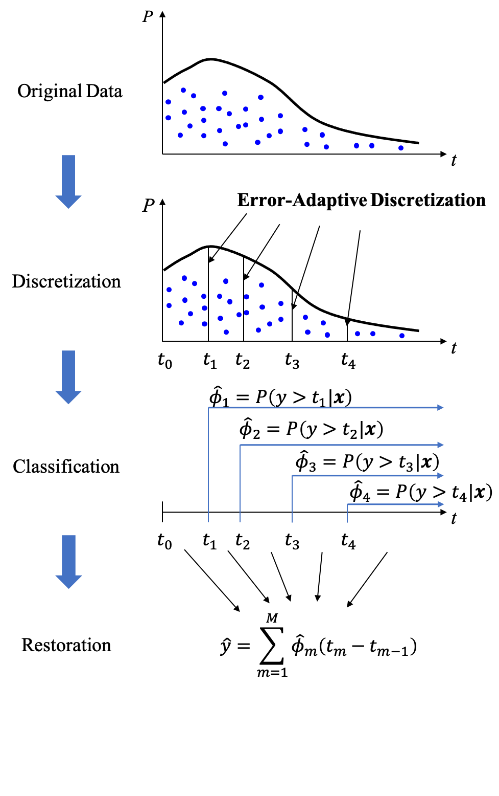

这是一篇来自快手的文章，主要讲了两件事，第一件事是如何对观看时长进行建模，第二件事是如何对连续特征进行分桶。

## 如何对观看时长建模？

快手（KWai）的短视频观看时长分布和我们的直播场景的观看时长有着类似的趋势，即数据极其不均衡，呈现典型的长尾分布。

通常预测观看时长有几种方法

1. Regression
2. Weighted Logistic Regression
3. Duration-Deconfounded Quantile
4. Ordinal Regression
5. Tree based Progressive Regression

**能否提出一个更简单的训练任务来预测观看时长？**
这篇文章提出的方案是，使用多个分类任务近似去拟合回归任务。具体的做法和我们处理连续特征的方案类似，把观看时长离散化分成多个桶，对于每个桶进行预测是否落到这个桶里。

需要注意的是这里的离散化方法并没有使用 onehot，而是预测大于某一时间阈值的概率，即

$$
y_m = (y>=t_m)
$$

### 推导

分类任务变成如下形式

$$
{\hat{\phi}}_m(x_i;\Theta_m)=P(y>t_m|x_i),1<=i<=N
$$

恢复公式推导

$$
\begin{align*}
\mathbb{E}(y|x_i)&=\int_{t=0}^{t_m}tP(y=t|x_i)dt \\
&= \int_{t=0}^{t_m}P(y>t|x_i)dt \\
&\approx\sum_{m=1}^MP(y>t|x_i)(t_m-t_{m-1})
\end{align*}
$$

这里重点看下第二步

$$
\begin{align*}
P(y>t)&=1-F(t) = R(t)\\
P(y=t)&=F^{'}(t)=-R^{'}(t)
\end{align*}
$$

可以带入式 1

$$
\begin{align*}
&\int_{t=0}^{t_m}tP(y=t|x_i)dt \\
= &-\int_{t=0}^{t_m}tR^{'}(t)dt \\
= &-tR(t)|_{0}^{t_m}+\int_{t=0}^{t_m} t^{'}*R(t)dt \\
=&\int_{t=0}^{t_m}P(y>t|x_i)dt
\end{align*}
$$

结合就能得到

$$
\hat{y}=\sum_{m=1}^{M}\Theta_m(t_m-t_{m-1})
$$

### 损失函数

损失函数由三部分组成
对每个分类的损失

1. 分类损失
   使用交叉熵
   $$
   \mathcal{L}_{ce} = \sum_{m=1}^{M}-y_mlog(\hat{\Theta}_m)-(1-y_m)log(1-\hat{\Theta}_m)
   $$
2. 恢复损失
   使用 Huber loss
   $$
   \mathcal{L}_{restore}=\ell(\hat{y},y)
   $$
3. 顺序先验正则化项
   概率随着 m 增长单调减少
   $$
   \mathcal{L}_{ord}=\sum_{m=1}^{M-1}max(\hat{\Theta}_{m+1}-\hat{\Theta}_{m},0)
   $$
   我感觉这篇文章看到这里已经可以了，它给出了一个新的预测观看时间的方式，数学理论也比较强。
   文章后面则探讨了另外一个问题，也就是如何分桶。

## 自适应分桶

作者提出，对连续数据离散化会出现两种误差

1. 学习误差
   由于每个桶中的实例数量是有限的，因此 M 个分类器不可能无限准确。当我们增加桶的数量 M 时，每个桶中的实例数量就会减少，从而限制了分类性能。

2. 恢复误差
   离散化过程中使用求和代替积分，省略了每个桶中详细的概率密度，这也会引入误差。

显而易见，这两个误差不能同时减少。为了减少学习误差，需要更大的桶宽度，从而导致更大的恢复误差。
传统上，我们有两种分类方法，等距分桶和等频分桶，但是这两种方案都不够好。

作者通过一系列的推导得出了

其中$A_w$, $A_b$分别表示学习误差和恢复误差：

公式（21）中的 $\beta$ 可以视为超参数，问题其实还没解决，因为公式（21）只是告诉我们如何计算$t_m$对应的误差，并没有告诉我们如何设置$t_m$才能最小化误差。

然后，作者介绍了一种启发式的方法（就是在等频和等距之间做 trade-off）。首先，正式表达等宽等频离散化方法，

- 等距定义如下，等距会导致长尾的桶中样本数量太小，增加学习误差

  $$
  t_m = \frac{m}{M}T_{max}
  $$

- 等频定义如下，等频会导致长尾的桶的间隔太大，增加恢复误差：
  $$
  t_m = \Psi^{-1}(\frac{m}{M})
  $$

这样我们可以将两个公式合并

$$
t_m = \Psi^{-1}(\gamma\frac{m}{M})
$$

这里的 $\gamma$ 是一个从$[0,1]\rightarrow[0,1]$的校准函数,要满足$\gamma(0)=0$ , $\gamma(1)=1$。
当 $\gamma(z)=\Psi(zT_{max})$ 为等频分桶
当 $\gamma(z)=z$ 为等距分桶

问题变成了如何寻找校准函数 $\gamma$来平衡等频分桶与等距分桶。本文使用了截断指数分布建模

$$
\gamma(z,\alpha)=(1-e^{-\alpha z})/(1-e^{-\alpha})
$$

## 实验和超参数

- https://zhuanlan.zhihu.com/p/678883395
- https://arxiv.org/pdf/2401.07521
- https://zhuanlan.zhihu.com/p/671950137
- https://arxiv.org/pdf/2306.03392
- https://zhuanlan.zhihu.com/p/678368070
- https://arxiv.org/pdf/2206.06003
