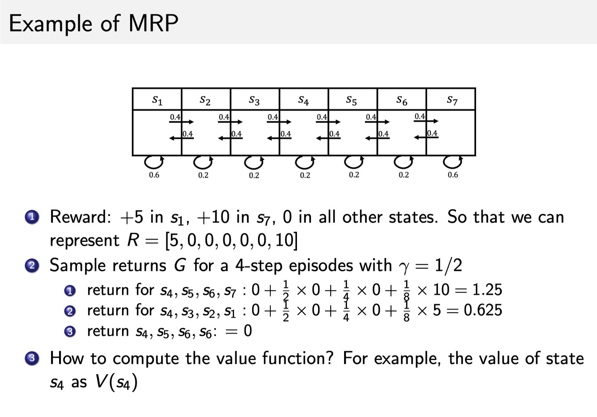

## 强化学习简介

强化学习（英语：Reinforcement learning，简称 RL）是机器学习中的一个领域，强调如何基于环境而行动，以取得最大化的预期利益

强化学习讨论的问题是一个智能体(agent) 怎么在一个复杂不确定的环境(environment)里面去极大化它能获得的奖励。

### 例子

Atari 游戏

在游戏过程中，大家可以发现这个 agent 得到的观测不是个独立同分布的分布，上一帧下一帧其实有非常强的连续性。

另外一点，在玩游戏的过程中，你并没有立刻获得反馈，没有告诉你哪个动作是正确动作。所以强化学习这么困难的原因是没有得到很好的反馈，然后你依然希望 agent 在这个环境里面学习。

强化学习的训练数据就是这样一个玩游戏的过程。你从第一步开始，采取一个决策，比如说你把这个往右移，接到这个球了。第二步你又做出决策，得到的训练数据是一个玩游戏的序列。

Agent 获得自己能力的过程中，其实是通过不断地试错探索(trial-and-error exploration)。
探索(exploration)和利用(exploitation)是强化学习里面非常核心的一个问题。
探索：你会去尝试一些新的行为，这些新的行为有可能会使你得到更高的奖励，也有可能使你一无所有。
利用：采取你已知的可以获得最大奖励的行为，你就重复执行这个动作就可以了，因为你已经知道可以获得一定的奖励。
因此，我们需要在探索和利用之间取得一个权衡。

## MDP

无数学者们通过几十年不断地努力和探索，提出了一套可以解决大部分强化学习问题的框架，这个框架就是马尔科夫决策过程，简称 MDP。下面我们会循序渐进地介绍马尔科夫决策过程：先介绍马尔科夫性，再介绍马尔科夫过程，最后介绍马尔科夫决策过程。

### Markov Process(MP)

#### Markov Property

如果一个状态转移是符合马尔可夫的，那就是说一个状态的下一个状态只取决于它当前状态，而跟它当前状态之前的状态都没有关系。

我们设状态的历史为 $h=\{s_1,s_2,s_3...s_t\}$ , 如果一个状态转移是符合马尔可夫的，也就是满足如下条件：

$$
p(s_{t+1}|s_t) = p(s_{t+1}|h_t)
$$

$$
p(s_{t+1}|s_t,a_t) = p(s_{t+1}|h_t,a_t)
$$

#### Markov Process/Markov Chain

我们可以用状态转移矩阵(State Transition Matrix) P 来描述状态转移 $p(s_{t+1}=s'|s_t=s)$ :

$$
P =
\begin{bmatrix}
p(s_1|s_1) & p(s_2|s_1) & \cdots & p(s_N|s_1) \\
p(s_1|s_2) & p(s_2|s_2) & \cdots & p(s_N|s_1) \\
\vdots     & \vdots     & \ddots & \vdots     \\
p(s_1|s_N) & p(s_2|s_N)&  \cdots & p(s_N|s_N) \\
\end{bmatrix}
$$

#### Markov Reward Process(MRP)

这里是我们刚才看的马尔可夫链，如果把奖励也放上去的话，就是说到达每一个状态，我们都会获得一个奖励。这里我们可以设置对应的奖励，比如说到达 $s_1$ 状态的时候，可以获得 5 的奖励，到达 $s_7$ 的时候，可以得到 10 的奖励，其它状态没有任何奖励。因为这里状态是有限的，所以我们可以用向量 R=[5,0,0,0,0,0,10] 来表示这个奖励函数，这个向量表示了每个点的奖励大小。

我们通过一个形象的例子来理解 MRP。我们把一个纸船放到河流之中，那么它就会随着这个河流而流动，它自身是没有动力的。所以你可以把 MRP 看成是一个随波逐流的例子，当我们从某一个点开始的时候，这个纸船就会随着事先定义好的状态转移进行流动，它到达每个状态过后，我们就有可能获得一些奖励。

Return(回报) 说的是把奖励进行折扣后所获得的收益。Return 可以定义为奖励的逐步叠加，如下式所示：

$$
G_t = R_{t+1} + \gamma R_{t+2} + \gamma^2 R_{t+3} + \gamma^3 R_{t+4} + \cdots + \gamma^{T-t-1} R_T
$$

当我们有了 return 过后，就可以定义一个状态的价值了，就是 state value function。对于 MRP，state value function 被定义成是 return 的期望，如下式所示：

$$
V_t(s)=\mathbb{E}[G_t|s_t=s]
$$

### Markov Decision Process(MDP)

相对于 MRP，马尔可夫决策过程(Markov Decision Process)多了一个 decision，其它的定义跟 MRP 都是类似的

状态转移也多了一个条件，变成了 $P(s_{t+1}=s'|s_t=s,a_t=a)$ 你采取某一种动作，然后你未来的状态会不同。未来的状态不仅是依赖于你当前的状态，也依赖于在当前状态 agent 采取的这个动作。
同样的，价值函数变为$R(s_t=s,a_t=a)=\mathbb{E}[r_t|s_t=s,a_t=a]$

#### Policy in MDP

$$
\pi(a|s)=P(a_t=a,s_t=s)
$$

概率就代表了在所有可能的动作里面怎样采取行动，比如可能有 0.7 的概率往左走，有 0.3 的概率往右走，这是一个概率的表示

$$
P^{\pi}(s'|s) = \sum_{a\in A}\pi(a|s)*P(s'|s,a)
$$

$$
R^{\pi}(s) = \sum_{a\in A}\pi(a|s)*R(s,a)
$$

状态-价值函数(state-value function)

$$
v^{\pi}(s)=\mathbb{E}_\pi[G_t|s_t=s]
$$

Q 函数(Q-function) 也被称为 action-value function
Q 函数定义的是在某一个状态采取某一个动作，它有可能得到的这个 return 的一个期望

$$
q^{\pi}(s,a)=\mathbb{E}_\pi[G_t|s_t=s,a_t=a]
$$

### Bellman Equation

$$
\begin{aligned}
V(s) &= \mathbb{E}[G_t|s_t=s] \\
     &=\mathbb{E}[R_{t+1}+\gamma R_{t+2}+ \gamma^2 R_{t+3}+\cdots| s_t=s] \\
     &= \mathbb{E}[R_{t+1}|s_t=s]+\gamma \mathbb{E}[R_{t+2}+\gamma R_{t+3}+ \gamma^2 R_{t+4}+\cdots|s_t=s] \\
     &= R(s)+\gamma \mathbb{E}[G_{t+1}|s_t=s] \\
     &= R(s) + \gamma \mathbb{E}[V(s_{t+1})|s_t=s]
\end{aligned}
$$

## 好玩的例子

https://gym.openai.com/videos/2019-10-21--mqt8Qj1mwo/MountainCar-v0/original.mp4
