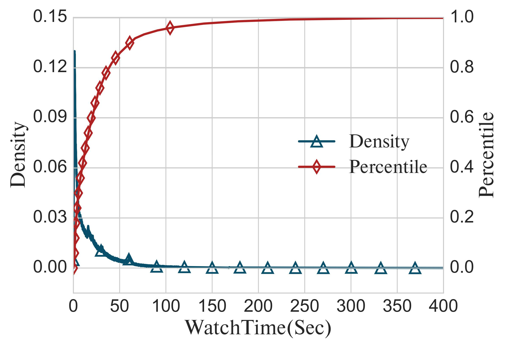
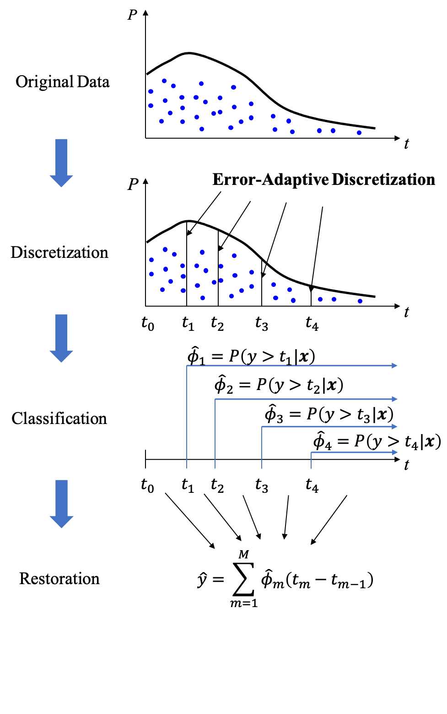
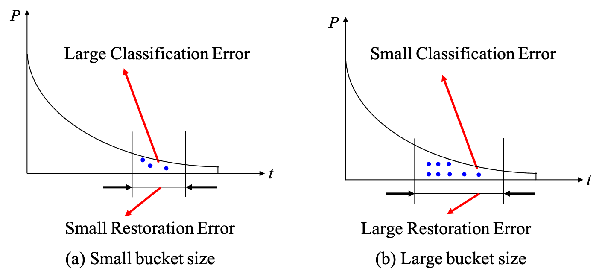
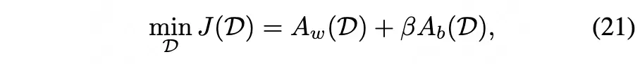
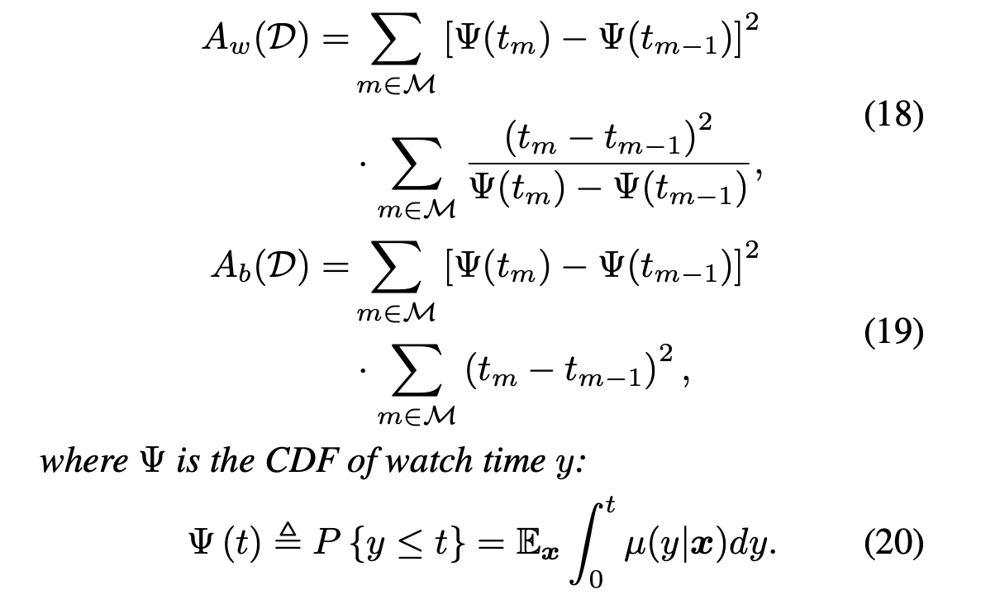
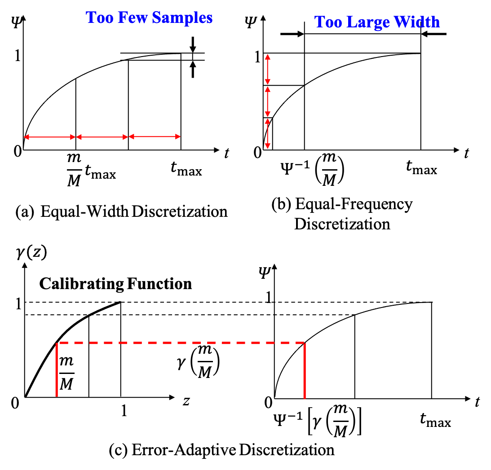
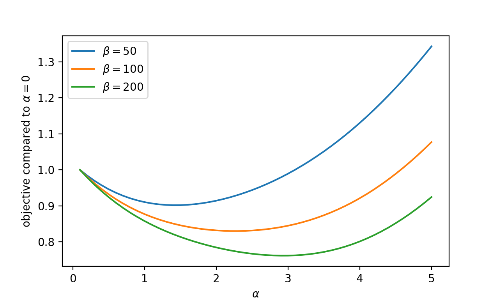
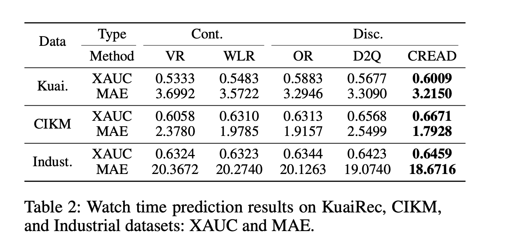
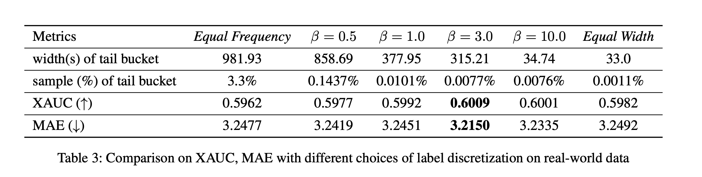
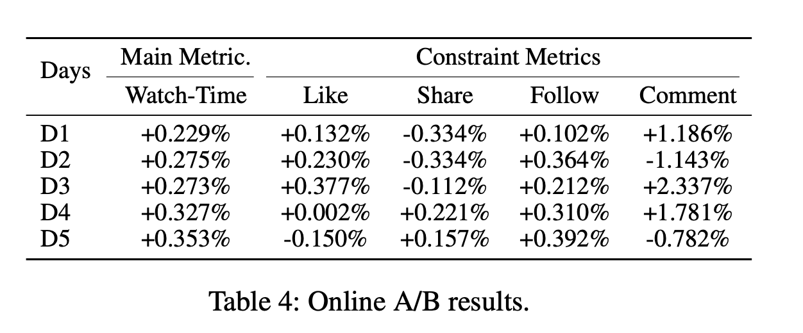

This is an article from Kwai, mainly discussing two topics: modeling watch time and bucketing continuous features.

## How to Model Watch Time?

Kwai's short video watch time distribution exhibits a similar pattern to our live streaming watch time, where data is extremely imbalanced and follows a typical long-tail distribution.

Usually, there are several methods for predicting watch time:

1. Regression
2. Weighted Logistic Regression
3. Duration-Deconfounded Quantile
4. Ordinal Regression
5. Tree-based Progressive Regression

**Can a simpler training task be proposed to predict watch time?**

The solution proposed by this article is to use multiple classification tasks to approximate a regression task. The specific approach is similar to our method for handling continuous features, by discretizing watch time into multiple buckets and predicting whether the value falls into each bucket.

It is important to note that the discretization method here does not use one-hot encoding, but rather predicts the probability of exceeding a certain time threshold:

$$
y_m = (y>=t_m)
$$

### Derivation

The classification task becomes the following:

$$
{\hat{\phi}}_m(x_i;\Theta_m)=P(y>t_m|x_i),1<=i<=N
$$

Recovery formula derivation:

$$
\begin{align*}
\mathbb{E}(y|x_i)&=\int_{t=0}^{t_m}tP(y=t|x_i)dt \\
&= \int_{t=0}^{t_m}P(y>t|x_i)dt \\
&\approx\sum_{m=1}^MP(y>t|x_i)(t_m-t_{m-1})
\end{align*}
$$

Focusing on the second step:

$$
\begin{align*}
P(y>t)&=1-F(t) = R(t)\\
P(y=t)&=F^{'}(t)=-R^{'}(t)
\end{align*}
$$

Substitute into formula 1:

$$
\begin{align*}
&\int_{t=0}^{t_m}tP(y=t|x_i)dt \\
= &-\int_{t=0}^{t_m}tR^{'}(t)dt \\
= &-tR(t)|_{0}^{t_m}+\int_{t=0}^{t_m} t^{'}*R(t)dt \\
=&\int_{t=0}^{t_m}P(y>t|x_i)dt
\end{align*}
$$

Combining these results gives:

$$
\hat{y}=\sum_{m=1}^{M}\Theta_m(t_m-t_{m-1})
$$

### Loss Function

The loss function consists of three parts:

1. Classification Loss
   Using cross-entropy:

   $$
   \mathcal{L}_{ce} = \sum_{m=1}^{M}-y_m\log(\hat{\Theta}_m)-(1-y_m)\log(1-\hat{\Theta}_m)
   $$

2. Recovery Loss
   Using Huber loss:

   $$
   \mathcal{L}_{restore}=\ell(\hat{y},y)
   $$

3. Ordinal Prior Regularization
   Probability should monotonically decrease with increasing m:
   $$
   \mathcal{L}_{ord}=\sum_{m=1}^{M-1}\max(\hat{\Theta}_{m+1}-\hat{\Theta}_{m},0)
   $$

I think this part of the article already provides a new way to predict watch time with strong mathematical foundations. The next part discusses how to perform bucketing.

## Adaptive Bucketing

The author points out that discretizing continuous data introduces two types of errors:

1. Learning Error
   Since the number of instances in each bucket is limited, the M classifiers cannot be infinitely accurate. Increasing the number of buckets M decreases the number of instances per bucket, thereby limiting classification performance.

2. Recovery Error
   During discretization, using summation instead of integration omits the detailed probability density within each bucket, which introduces error.

Clearly, these two errors cannot be reduced simultaneously. To reduce learning error, we need larger bucket widths, which increases recovery error.

Traditionally, there are two bucketing methods: equal-width bucketing and equal-frequency bucketing. However, both methods are suboptimal.

The author derives the following error formula:

Where $A_w$, $A_b$ represent learning error and recovery error respectively:

In Formula (21), $\beta$ can be considered a hyperparameter. The problem is not yet solved, because Formula (21) only tells us how to calculate the error corresponding to $t_m$, but not how to set $t_m$ to minimize the error.

Then, the author introduces a heuristic method (balancing between equal-frequency and equal-width). First, the equal-width and equal-frequency discretization methods are formally expressed:

- Equal-width definition:

  $$
  t_m = \frac{m}{M}T_{max}
  $$

  This approach results in too few samples in the long-tail buckets, increasing learning error.

- Equal-frequency definition:

  $$
  t_m = \Psi^{-1}(\frac{m}{M})
  $$

  This approach results in overly large intervals in the long-tail buckets, increasing recovery error.

Combining the two formulas gives:

$$
t_m = \Psi^{-1}(\gamma\frac{m}{M})
$$

Where $\gamma$ is a calibration function from $[0,1] \rightarrow [0,1]$ satisfying $\gamma(0)=0$ and $\gamma(1)=1$.

- When $\gamma(z)=\Psi(zT_{max})$, it is equal-frequency bucketing.
- When $\gamma(z)=z$, it is equal-width bucketing.

The problem becomes finding a calibration function $\gamma$ to balance equal-frequency and equal-width bucketing. The article uses a truncated exponential distribution model:

$$
\gamma(z,\alpha)=\frac{1-e^{-\alpha z}}{1-e^{-\alpha}}
$$

## Experiments and Hyperparameters

- https://zhuanlan.zhihu.com/p/678883395
- https://arxiv.org/pdf/2401.07521
- https://zhuanlan.zhihu.com/p/671950137
- https://arxiv.org/pdf/2306.03392
- https://zhuanlan.zhihu.com/p/678368070
- https://arxiv.org/pdf/2206.06003
