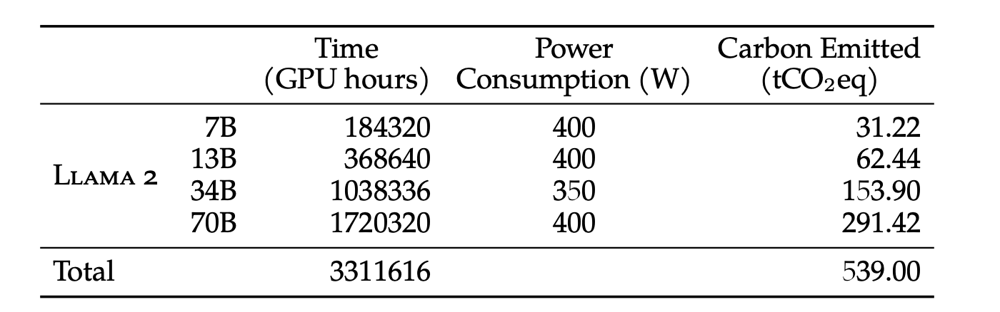
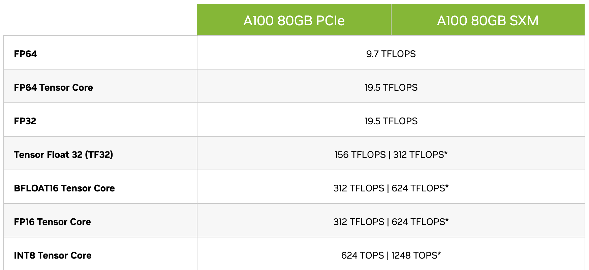
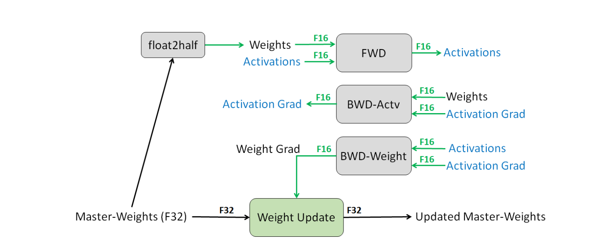
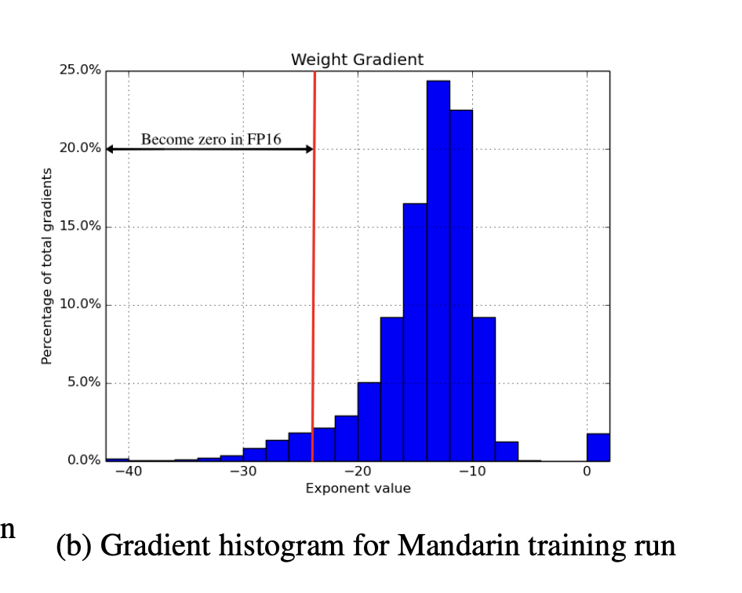

## 为什么需要混合精度训练
随着现代神经网络规模的迅速增长，从几十亿到几千亿的模型变得非常常见，我们的硬件能力显得相对有限。程序性能受到计算带宽、内存带宽和延迟三个因素的制约。为了解决这一问题，一种自然的思路是通过降低精度来提升性能，即使用较少位数存储相同数量的值，以减轻内存带宽压力。在处理器上，降低精度数再计算也可以提高算术运算的吞吐量。






## 混合精度训练步骤
详细的混合精度训练步骤如下图所示：


## IEEE754
在上世纪六七十年代，各计算机公司采用不同的浮点数表示，缺乏业界通用标准，给数据交换和计算机协同工作带来不便。1980年，英特尔推出了8087浮点数协处理器，其浮点数表示法及定义的运算被IEEE采用作为浮点数的标准，于1985年发布。

### 整体解释
IEEE 754浮点数表示法的最高有效位是符号位，接下来的位存储指数部分，剩余的位存储有效数的小数部分。指数偏移值是指数域的编码值，规定为$2^{e-1}-1$，其中e为存储指数的比特的长度。
### 指数偏移值
指数偏移值（exponent bias），即浮点数表示法中指数域的编码值，等于指数的实际值加上某个固定的值。IEEE 754标准规定该固定值为$2^{e-1}-1$，其中的e为存储指数的比特的长度。
以单精度浮点数为例，它的指数域是8个bit，固定偏移值是$2^{8-1}-1=127$。
### 规约形式的浮点数
当浮点数的指数编码值在(0, $2^{e-2}$]之间，且在科学表示法下，分数部分最高有效位是1时，称之为规约形式的浮点数。
$$
(-1)^S \times 1.M \times 2^{127+E}
$$
### 非规约形式的浮点数
如果浮点数的指数编码值是0，分数部分非零，那么称之为非规约形式的浮点数。
$$
(-1)^S \times 0.M \times 2^{-126}
$$
### 特殊值
- 如果指数为0且尾数的小数部分是0，则为±0。
- 如果指数为$2^{e-1}$且尾数的小数部分是0，则为±∞。
- 如果指数为$2^{e-1}$且尾数的小数部分非0，则为非法数（NaN）。

总览表格：

| 类型 | 指数位 | 尾数位 | 最大值| 最小值|
| ---- |  ---- |  ---- | ---- | ---- | 
|FP32|8|23|3.40E38|1.4E-45|
|FP16|5|10|65504|5.96E-8|
|BF16|8|7|3.38E38|9.2E−41|

## 解决问题

### 下溢出
在深度学习中，使用FP16替换FP32可能导致下溢（Underflow）的问题。下溢指的是更新（权重梯度乘以学习率）变得太小，在FP16中无法表示。通过在FP32中计算更新，可以避免这个问题，确保模型的准确性。

另一种解释是，权重值与权重更新的比率非常大，即使在FP16中可表示，右移它以与权重对齐的过程中仍可能变为零。这可能发生在标准化的权重值的幅度至少比权重更新的幅度大2048倍时。通过在FP32中计算更新可以抵消这种效应。

  
### loss缩放

FP16的指数偏置将规格化值的指数范围居中到[-14, 15]，而实际中的梯度值往往以较小的幅度为主导。通过放大梯度，可以将其移动到更多的可表示范围内，并防止部分值变为零。
  
为了有效地将梯度值移动到FP16可表示范围内，可以在前向传播中计算的损失值上进行缩放。选择缩放因子的方法有多种，可以根据经验选择一个常数缩放因子，也可以根据最大绝对梯度值的乘积低于FP16中可表示的最大值来选择。

### 计算精度
总体上，神经网络中的算术运算主要分为三类：点积、reductions和逐点操作。当涉及到降低精度的计算时，这些类别在处理时有不同的处理方式。为了保持模型的准确性，我们发现一些网络要求FP16向量点积将部分积累加到FP32值中，然后再转换为FP16后写入内存。在没有这种FP32中的积累的情况下，一些FP16模型的准确性无法与基线模型匹配。而之前的GPU只支持FP16的乘加运算，NVIDIA Volta GPU引入了张量核心（Tensor Cores），可以将FP16输入矩阵相乘并将积累到FP16或FP32输出中（NVIDIA，2017）。

大规模的reductions（对向量元素求和）应当在FP32中进行。这样的归约主要出现在批量归一化层在累积统计数据和softmax层时。在我们的实现中，这两种层类型仍然从内存中读取和写入FP16张量，但在FP32中执行算术运算。这并没有减慢训练过程，因为这些层在内存带宽上受到限制，不太受算术速度的影响。

逐点操作，比如非线性操作和逐元素矩阵乘积，主要受到内存带宽的限制。由于算术精度不影响这些操作的速度，可以使用FP16或FP32计算。


## demo
```python
# 在默认精度下创建模型
model = Net().cuda()
optimizer = optim.SGD(model.parameters(), ...)

# 在训练之前创建 GradScaler.
scaler = GradScaler()

for epoch in epochs:
    for input, target in data:
        optimizer.zero_grad()

        with autocast(device_type='cuda', dtype=torch.float16):
            output = model(input)
            loss = loss_fn(output, target)

        scaler.scale(loss).backward()

        scaler.step(optimizer)

        scaler.update()
```

参考
- [MIXED PRECISION TRAINING](https://arxiv.org/pdf/1710.03740.pdf)