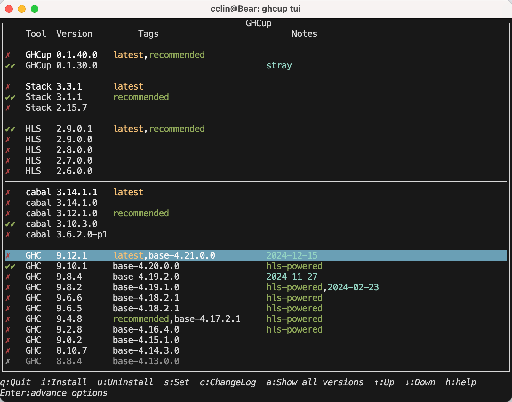

很多程序员可能会问，为什么要学一门如此小众的语言？为了逼格吗？
https://rwh.readthedocs.io/en/latest/chp/1.html
https://www.w3cschool.cn/hsriti/
https://juejin.cn/post/7330071686489735208

## 安装

安装haskell对于程序员来说应该没有任何挑战了。我个人比较推荐通过 [ghcup](https://www.haskell.org/ghcup/) 的方式安装。
安装好ghcup以后，我们在命令行输入

```sh
ghcup tui
```

会进入一个TUI界面，

通过方向键上下选择，**i** 键安装，**s** 键设置成当前环境。这里介绍下这几个部分的作用。

如果以其他语言作对比，cabal类似于python的pip和CMake，stack 类似于python的poetry或者npm+nvm。HLS是一个haskell的LSP实现，是使用vscode
等插件必装的项目，最后GHC就是语言本体了。如果你不知道选哪个版本的话直接选择recommended就好。

安装好以后可能需要把相关目录添加到PATH中以方便使用

```sh title=~/.zshrc
export PATH="${HOME}/.ghcup/bin":${PATH}
```

这样我们通过ghci命令即可进入交互式编程的环境。
